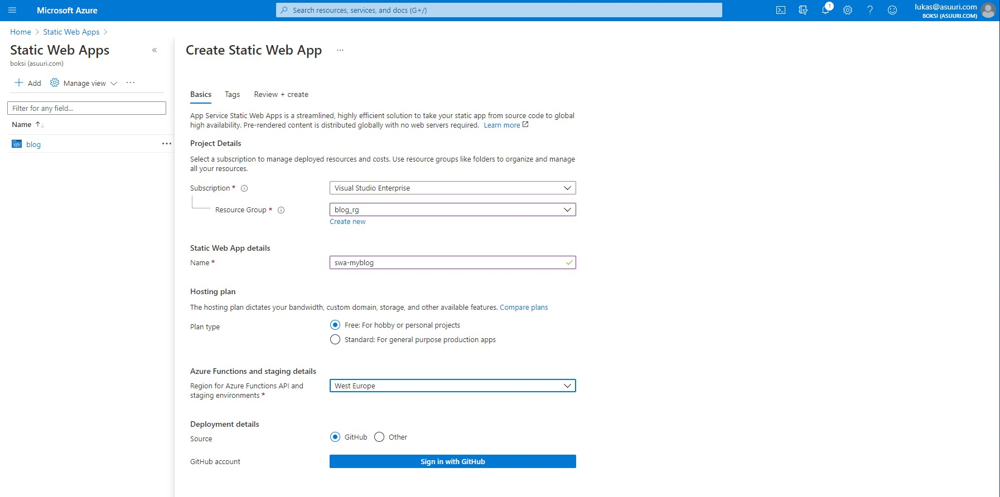
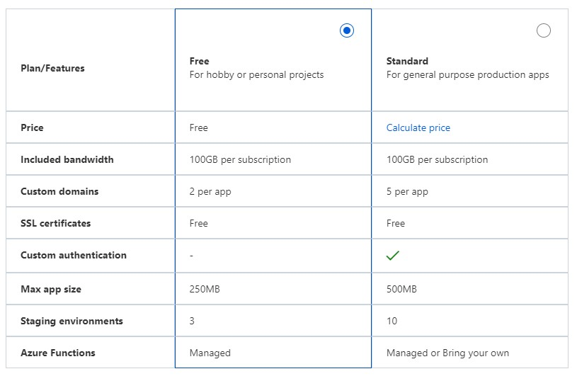
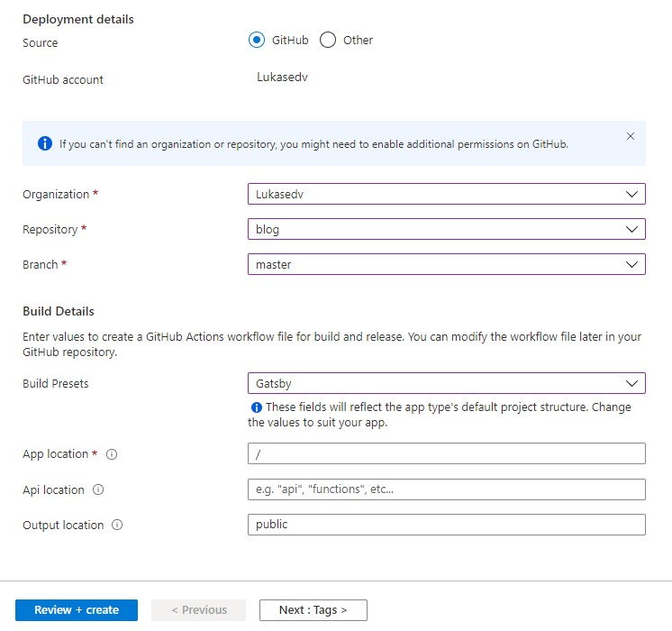
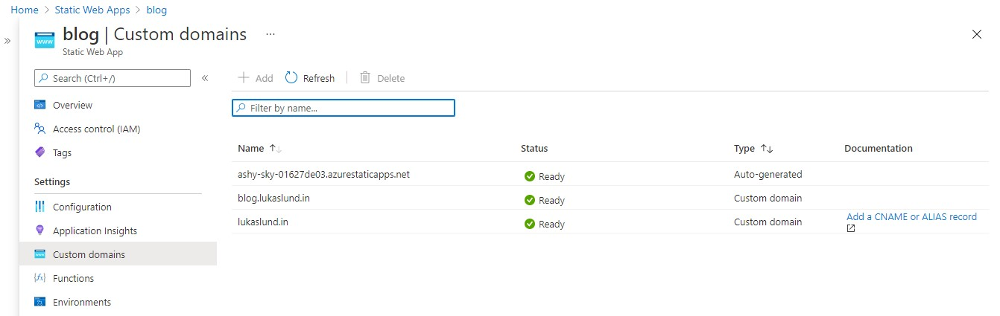
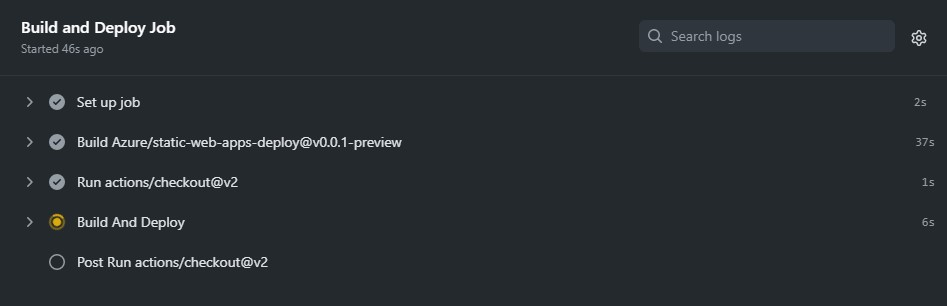
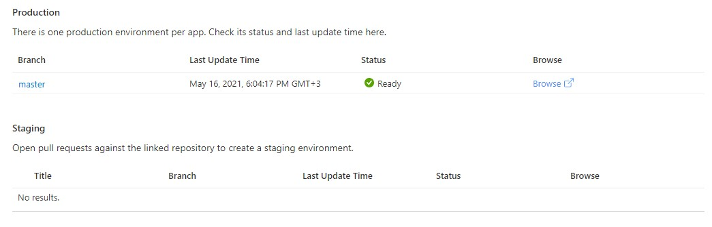

In the previous part we developed a JAMstack blog without leaving the browser, using GitHub Codespaces. The result of that part was a GitHub repository that we will now deploy using a brand new Azure service called Static Web App (I really like the no-nonsense naming of Azure services!).

Azure Static Web Apps are similar to GitHub Pages, but enable you to connect other useful Azure services to your page, like functions, custom domains, and monitoring. 

### Creating a Static Web App

With your repository ready, open Azure and search for Static Web App in the search bar. Go ahead and create a new service, the instructions are incredibly straight-forward.

Select hosting plan according to your needs, I believe the free tier can take you a long way for personal projects. The pricing tiers are listed below and [more information can be found here.](https://azure.microsoft.com/en-us/pricing/details/app-service/static/) I am going to select Free for this blog.

The following step is to connect your GitHub repository by logging into GitHub and authenticating. Then you can choose your organization, repository, and branch. If you followed the previous step, you should pick the master/main branch. 

Under build details you choose which framework you are using, and Gatsby can be found as a preset. Pick Gatsby, and leave the rest of the fields as they are.

Press Review + create and let Azure do some magic. A CI/CD pipeline will be set up in GitHub Actions, and automatically pull the code, build your blog, and deploy it for you! You will also be handed a random URL to access the page. 

### Adding a custom domain name

The random URL might not be very human-friendly, so connecting a domain name to your blog is probably of high priority. Domains can be acquired through a lot of different providers and this tutorial will not focus on how to purchase a domain, those instructions differ a bit between registrar. 

Once you have bought your domain, you can add it as a custom domain by following the instructions on screen. You add a record somewhere in the DNS settings at your registrar, and it takes a little while to verify, after which your domain will point to your blog.

### Updating the blog

Now your repository is connected to a pipeline in GitHub Actions, that listens to any update in the repository. When something changes, like an added .mdx file for a blog post, it automatically leaps into action by re-building your blog in a couple of minutes. 

It might be a bit tedious to push a new folder containing your pictures and an .mdx file every time you want to publish a new blog post, but we will look into adding some form of light CMS in a future post. 

### Bonus: Automatic staging environment by pull request

One really cool feature of Static Web App is that it automatically builds and hosts development versions of your website based on pull requests. This development site can then be used to test your code before merging it to the main branch. 

Let's say you are blogging with multiple people, then a pull request could be made for each blog post, and the editor-in-chief could have a look at the blog in a live production environment before merging it into the public blog.

### Thank you for reading

In a future post I will try to implement some form of content management system like Contentful, to make the blog posting workflow smoother, as well as visitor statistics.
