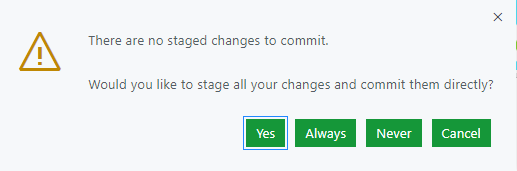

Do you want to host your own blazingly fast blog on Azure (for free as of the moment of writing)? Do you want to do this without leaving the convenience of your browser or installing a single tool locally? You have found the right place! This blog is the end result of the guide.

> Disclaimer: This Guide will use two preview features, [GitHub Codespaces](https://github.com/features/codespaces), that not everyone have access to yet, and [Azure Static Web App Service](https://azure.microsoft.com/en-us/services/app-service/static/). 
This started as a simple project with the aim to develop a lightweight blog locally, and host it as a Static Web App on Azure. Along the way it evolved a bit. While uploading the first iteration to my GitHub repository I noticed the Codespaces feature and got curious - can I replace my local environment with one in the cloud?

## Speed over convenience?
There are always trade-offs to be made when selecting a technology for something. The same applies when developing a blog site. 

Wordpress and the old school CMSs might offer simple tools for setting up a website or blog from a content creator’s point of view, but falls behind in performance and security, and requires maintenance. 

Static websites, on the other hand, are fast and secure, but require effort to update. It is however possible to make static websites as easy to use as traditional Wordpress blogs, by using what is called a **JAMstack**. 
```
* J - Javascript
* A - APIs
* M - Markup
```
**Javascript** libraries and functionalities handle all the heavy lifting and enables you to plug and play with a lot of different features. It also enables dynamic reload while developing and finally packages your site into a super-optimized package for deployment.

Server side operations are then handled by **APIs** and accessed over HTTPS with JavaScript. These can be third party services or your custom function. In our case we will not use external APIs for the content, maybe in the future.

Finally, the content will be delivered as **Markup** language, a great and simple way to format content. Websites are served as static HTML files. These can be generated from source files, such as Markdown, using a Static Site Generator.

So this guide revolve around deploying this secret sauce to fast websites, a JAMstack.

### Picking a static website generator
There are many static website frameworks out there, and the field is constantly changing. I chose to build this blog with [Gatsby](https://www.gatsbyjs.com/), which is a static website accelerator built upon React. I chose this mainly because the amount of tutorials and other resources available for this framework. Or maybe it was their sleek landing page? [You can find a list of other static site generators here.](https://jamstack.org/generators/)


## GitHub as development environment
GitHub in its core is a host for code repositories. You fetch code, branch, develop locally and then commit your changes and get them merged with the main. But that's not all...

There are new additions to GitHub like Codespaces, that take the entire platform to another level by enabling you to **develop** where the code is. In the cloud. Codespaces are what they sound like - isolated development environments that can be accessed through browsers on any device.

### ...and CMS
As earlier stated, one weakness of static web sites have been that it can be a chore to add new content compared to using a more traditional CMS. But here is the deal: With GitHub you can edit and add blog posts to your static website, right there in the browser. It therefore acts as a content management system too. This works without the previously mentioned codespace or even local environment. GitHub enables you to edit files right in the repository. This might not be a good feature when working on large projects, but for a blog it works. 

## Let’s go
This guide assumes you are somewhat familiar with web development and Git, but worry not, I have included links to relevant tutorials.

### 1. Set up GitHub
I won't go into much details here, but if you are completely new to the world of Git and GitHub, there are some great resources [here](https://guides.github.com/activities/hello-world/)

#### Clone a template
[Gatsby has a huge template community](https://www.gatsbyjs.com/starters/?) and it didn't take long to find a sleek template that seems to require minimal modding. I chose the [LekoArts minimal blog starter](https://github.com/LekoArts/gatsby-starter-minimal-blog). Navigate to the starter of your choice, and press `Use this template`, at the top right. This will then prompt you to create an own repository. Go ahead and do that.


### 2. Activate your Codespace
When your new stolen goods are in the safety of your own repository we can go ahead and activate the Codespace. The GitHub Codespace feature can be found under the familiar `Code` dropdown above the files.

Initializing a codespace takes maybe a minute. 
It is important that you let the Codespace *settle* before doing anything. There is a `yarn` script running that downloads all the node packages needed for Gatsby. You can follow this process if you switch terminal to `2: GitHub Codespaces` at the bottom. You can move on when you get the following message:
```
Finished configuring codespace.
```


### 3. Start developing and customizing the template
When the codespace is done we can start developing and customizing the blog template. To start the development server and see your blog live you can run this yarn script. You don't even need to install the gatsby-cli, since yarn does all the lifting.

```
yarn run develop
```
You will be prompted that a server is running on port 8000. You can then press the pop-up button to open the site in another tab, or navigate to the "Ports" tab next to the terminal, and select the local address for port 8000.

Feel free to configure whatever you want, the template instructions can be found in the README.md file in the menu to your left, or [here.](https://github.com/LekoArts/gatsby-starter-minimal-blog)


I have listed all the changes I made to the template in the figure below. The trickiest part is the new ghosting feature of Gatsby templates, that means you have to create new files to override things like the footer and bio section of the template. You do this by adding files like `src/@lekoarts/gatsby-theme-minimal-blog/texts/hero.mdx` and editing those. But check the readme!

### 4. Commit changes
When your minimum-viable-blog is ready and you want to save your progress, we can proceed to committing the changes made. In the left menu you can find the "Source Control" tab. Here you can see all the changes you have made to the files in the repository. 


Press the checkmark at the top of the source control tab to commit all these changes. Since we don't use staging, you can go ahead and commit everything directly. Remember to add a message, or not, it's up to you. 



#### ...and push!
Commiting changes won't do anything yet, you also need to push these changes to the repository to save your progress. Press the three dots `...` in the menu and choose "push". 


After pressing push you can open your repository on GitHub and verify that everything has been securely pushed straight into production (*we will start using staging and branches in part 2 I promise*). After pushing the changes you can destroy the workspace since everything is saved to the repository. The next time you want to mod something you can launch a new one and start where you left it.

## To be continued
In the next post we will deploy this newly modded repository to the Static Web App service on Azure. There are some really cool features that I can't wait to show! Automatic staging environments anyone? 

Stay tuned!

