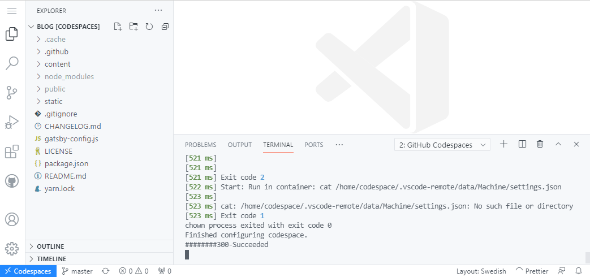

Creating a blazing fast blog with GitHub and Azure

Do you want to host your own blazingly fast blog on Azure (for free as of the moment of writing)? Do you want to do this without installing a single tool locally? You have found the right place! 

! This Guide assumes you have access to GitHub Codespaces, however you can can complete it in a local environment too.

> I started this project with the aim to develop a lightweight blog locally and host it as a Static Web App on Azure. While uploading the first iteration to my GitHub repository I noticed the Codespaces feature and got curious - can I replace my local environment with one in the cloud?

## Speed over convenience?
There are always trade offs to be made when selecting a technology for something. Wordpress and the old school CMSs might offer a simple website and blog platform from a content creator’s standpoint, but falls behind in performance and security, and requires maintenance. 

Static websites, on the other hand, are fast and secure, but require effort to update. It is however possible to make static websites as easy to use as traditional Wordpress blogs, by using what is called a JAMstack. 

* J - Javascript
* A - APIs
* M - Markdown

Javascript is used for development and enables interactive elements in your otherwise static webpage. The site is dynamic while you develop, but is then built into a static and optimised package for deployment.

APIs are used to access various sources for your content. Every page can be a file somewhere, or  

GitHub and DevOps magic to automate content updates, or by delivering the content through APIs.

This guide will be focused on deploying a jamstack.

### Picking a static website framework
There are many static website frameworks out there, and the field is constantly changing. 

I chose to build this blog with Gatsby, which is a static website accelerator built upon React. I chose this mainly because the amount of tutorials and other resources available for this framework.

## GitHub as development environment
GitHub in its core is a host for code repositories. You fetch code, branch, develop locally and then commit your changes and get them merged with the main. The foundation of DevOps. If you want to start learning more about DevOps and Git, HERE IS A GREAT RESOURCE.

There are however new additions to GitHub like Codespaces, that take this to another level by enabling you to develop where the code is. In the cloud.

Codespaces are what they sound like - isolated development environments that can be accessed through browsers on any device.

### ...and CMS
As earlier stated, one weakness of static web sites have been that it can be a chore to add new content compared to using a more traditional CMS. With GitHub you can edit and add blog posts to your static website, and it therefore acts as a content management system too. This works without a codespace or even local environment. GitHub enables you to edit files right there in the repository. This might not be a good feature when working on large projects, but for a blog it works. 

After merging changes to the main branch we can then set up GitHub actions and automate the re-build of the static pages after every content addition.

## Let’s go
This guide assumes you are somewhat familiar with web development and Git, but worry not, I have included links to relevant tutorials.

### Set up GitHub
I won't go into much details here, but if you are completely new to the world of Git and GitHub, there are some great resources [here](https://guides.github.com/activities/hello-world/)

#### Clone a template


### Activate your Codespace

Initializing a codespace takes maybe a minute. 
It is important that you let the Codespace "settle" before doing anything. There is a yarn script running that downloads all the node packages needed for Gatsby. You can follow this process if you switch terminal to 2: GitHub Codespaces at the bottom. You can move on when you get the following message:
```
Finished configuring codespace.
```


#### Start developing and customizing the template
When the codespace is done we can start developing and customizing the blog template. To start the development server and see you blog live you can run this yarn script. You don't even need to install the gatsby-cli!

```
yarn run develop
```
You will be prompted that a server is running on port 8000. You can then press the button to open the site in another tab, or navigate to the "Ports" tab next to the terminal, and select the local address for port 8000.

Feel free to configure whatever you want, the template instructions can be found in the README.md file in the menu to your left, or [here.](https://github.com/LekoArts/gatsby-starter-minimal-blog)


#### Commit changes
When your minimum-viable-blog is ready and you want to save your progress, we can proceed to committing the changes made. In the left menu you can find the "Source Control" tab. Here you can see all the changes you have made to the files in the repository. 


Press the checkmark at the top of the source control tab to commit all these changes. Since we don't use staging, you can go ahead and commit everything directly. Remember to add a message, or not, it's up to you. 


#### ...and push!
Commiting changes won't do anything yet, you also need to push these changes to the repository to save your progress. Press the three dots `...` in the menu and choose "push". 


After pressing push you can open your repository on GitHub and verify that everything has been securely pushed straight into production. 

 

